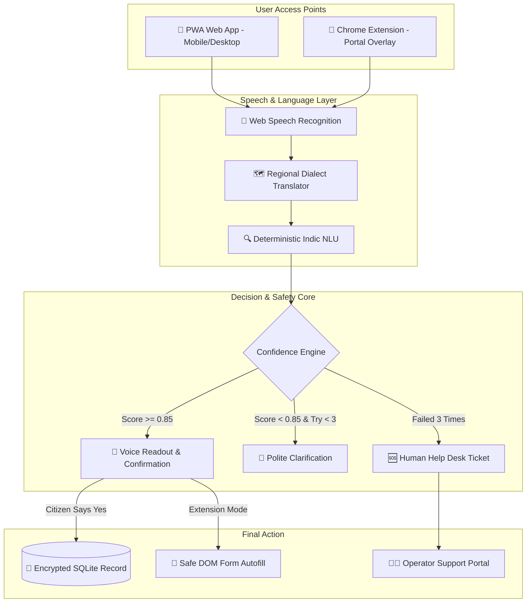

# 🎙️ Seva Vaani (सेवा वाणी)

> **Voice-first digital assistant bridging the gap between Indian citizens and complex government portals.**  
> Built with voice AI, regional dialect support, and a zero-guesswork deterministic engine so that every citizen can access public schemes in their mother tongue with confidence.

---

## 📌 Table of Contents

- [Overview](#-overview)
  - [Why We Built This](#why-we-built-this)
  - [How Seva Vaani Solves It](#how-seva-vaani-solves-it)
- [Key Features](#-key-features)
- [Technologies Used](#-technologies-used)
- [AI Tools & Models Used](#-ai-tools--models-used)
- [System Architecture](#-system-architecture)
- [Setup & Installation Instructions](#-setup--installation-instructions)
  - [Prerequisites](#prerequisites)
  - [1. Backend Setup](#1-backend-setup)
  - [2. Frontend Web App Setup](#2-frontend-web-app-setup)
  - [3. Chrome Extension Setup](#3-chrome-extension-setup)
- [How to Use Seva Vaani](#-how-to-use-seva-vaani)
  - [Using the Web App](#1-using-the-web-app)
  - [Using the Chrome Extension](#2-using-the-chrome-extension)
  - [Useful Voice Commands](#3-useful-voice-commands)
- [Project Structure](#-project-structure)
- [Important Information](#-important-information)
  - [Privacy & DPDP Act 2023 Compliance](#privacy--dpdp-act-2023-compliance)
  - [Testing & Quality Assurance](#testing--quality-assurance)
  - [Helpful Documents & PDFs](#helpful-documents--pdfs)
- [Authors & License](#-authors--license)

---

## 🌟 Overview

### Why We Built This

Filling out government forms online in India is often frustrating. Whether it is applying for a student scholarship, a farmer subsidy, or a welfare pension, millions of rural and semi-urban citizens encounter the same roadblocks:

1. **Language Barrier**: Most official portals are written in complex English or formal Sanskritized Hindi that everyday people do not speak at home.
2. **Dialect Diversity**: People speak Bhojpuri, Maithili, Chhattisgarhi, Haryanvi, or Ahirani/Khandeshi in their daily lives, but websites have zero support for regional phrasing.
3. **High Costs at Cyber Cafes / CSCs**: Citizens are forced to pay ₹50 to ₹200 to middle-men or cyber cafe operators just to type out basic personal details, often leading to spelling mistakes and leaked sensitive documents.
4. **Chatbot Hallucinations**: Standard AI chatbots frequently guess names, fabricate dates, or auto-submit forms without citizen confirmation—which is dangerous for legal government records.

### How Seva Vaani Solves It

**Seva Vaani (सेवा वाणी)** transforms rigid, confusing web forms into an interactive, friendly voice conversation. 

Instead of staring at a 10-field screen, citizens simply speak naturally in their dialect. The assistant listens, extracts the required information, speaks it back aloud for double-checking, and fills out the application step-by-step.

Most importantly, Seva Vaani follows a strict **"When Uncertain, Do Not Guess"** principle:
- **Zero Unconfirmed Submissions**: Nothing is saved until the citizen hears it and explicitly confirms with *"हाँ, सही है"* (Yes, that's correct).
- **3-Attempt Safety Net**: If speech recognition fails 3 times due to background noise or dialect variance, the app never leaves the user stranded—it automatically generates a human help desk ticket (`TKT-XXXXXX`) and opens a text fallback screen.
- **Works Everywhere**: Citizens can use Seva Vaani as a standalone mobile-friendly Web App (PWA) or install the Chrome Extension that overlays directly on top of existing government websites.

---

## ✨ Key Features

- **🗣️ Multi-Dialect Indic Voice Recognition**  
  Understands everyday Hindi, Marathi, and Indian English, with natural lexicon translation for regional dialects:
  - *Bhojpuri / Purvanchali* ("हमार नाम...", "बा")
  - *Maithili / Magahi* ("हमर नाम...", "छियै")
  - *Chhattisgarhi* ("मोर नाम...", "हावे")
  - *Haryanvi* ("म्हारा नाम...", "सै")
  - *Khandeshi / Ahirani Marathi* ("आम्हाले...", "भाऊ")

- **🔤 Phonetic Name & Spelling Disambiguation**  
  Handles phonetic variations in Indian family names (Pandey vs Pande, Tiwari vs Tewari, Mukherjee vs Mukhopadhyay). Includes a character-by-character phonetic spell-out engine so certificates always match official Aadhaar/marksheet records.

- **💰 Natural Language Currency & Date Converter**  
  Understands colloquial spoken numbers without requiring robot-like formats:
  - *"Ek lakh assi hazaar"* $\rightarrow$ `1,80,000`
  - *"Dedh lakh rupaye"* $\rightarrow$ `1,50,000`
  - *"Pandrahe August do hazaar do"* $\rightarrow$ `15/08/2002`

- **🛡️ 3-Trial Voice Guard (`MAX_VOICE_TRIALS = 3`)**  
  Shows a clear on-screen counter (`प्रयास 1/3`, `2/3`, `3/3`). If speech is not understood after 3 tries, it automatically switches to an accessible typing box and files an operator support ticket so nobody gets stuck.

- **📱 Fully Responsive & Offline-Ready (PWA)**  
  Works smoothly on every screen size—from small budget phones (320px) to desktop monitors. Features a registered Service Worker and IndexedDB store so citizens on flaky 2G/3G connections do not lose their progress.

- **🧩 One-Click Chrome Extension (Manifest V3)**  
  A modern dark-glassmorphic overlay that can be opened on top of any public portal. Automatically highlights target form fields and safely autofills them once the citizen gives consent.

- **🔒 Zero-Disk In-Memory Processing**  
  Files, marksheets, and audio streams are processed in transient RAM buffers and wiped immediately—no private citizen documents or raw audio files are ever written to disk or sent to foreign servers.

---

## 🛠️ Technologies Used

### Backend
- **Python 3.9+ & FastAPI**: Ultra-fast asynchronous REST API server with low turn-by-turn latency (<180 ms).
- **SQLite (WAL Mode)**: Lightweight, zero-config relational database with write-ahead logging and strict ACID transaction safety.
- **Pydantic v2**: Type-safe data validation schemas for all form fields, turn states, and help tickets.
- **Pytest**: Comprehensive test suite covering end-to-end voice flows, edge cases, and security rules.

### Frontend
- **React 18 & TypeScript**: Component-driven UI ensuring type safety across state transitions.
- **Vite**: Modern front-end build tool with lightning-fast hot module reloading.
- **TailwindCSS & Vanilla CSS**: Clean, accessible design system with dark glassmorphism and mobile-first responsive breakpoints.
- **PWA & Workbox**: Service Worker integration for offline asset caching and resilient low-bandwidth operation.

### Browser Audio & Extension
- **Web Speech API**: In-browser speech recognition (`webkitSpeechRecognition`) and localized speech synthesis (`SpeechSynthesisUtterance`).
- **Chrome Extension (Manifest V3)**: Isolated content scripts, scoped `postMessage` security protocol, and DOM mapper for smart field autofill.

---

## 🤖 AI Tools & Models Used

We deliberately avoided black-box generative chatbots for filling government forms because hallucinations on legal applications can lead to rejected scholarships or legal penalties. Instead, Seva Vaani uses a **hybrid, safety-first AI stack**:

| AI / Model Layer | Implementation | What It Does | Why It Was Chosen |
|:---|:---|:---|:---|
| **Speech Recognition (ASR)** | Web Speech API (`hi-IN`, `mr-IN`, `en-IN`) | Listens to spoken audio and produces raw transcript text in real time. | **Zero cloud latency & zero API costs.** Runs natively in the citizen's browser without uploading audio files to external servers. |
| **Voice Synthesis (TTS)** | Native `SpeechSynthesis` with rate modulation | Speaks questions, feedback, and confirmation prompts back to the citizen. | Allows low-literacy citizens to complete forms hands-free. Includes a slow-mode toggle (`0.70x`) for difficult phrases. |
| **Indic NLU & Entity Extractor** | Rule-Based Natural Language Extractor (Regex + Pattern Grammar) | Extracts names, dates, 10-digit mobile numbers, incomes, and categories from colloquial sentences. | **Zero hallucinations.** Deterministic grammar guarantees that only valid, verifiable information is extracted from citizen speech. |
| **Regional Dialect Normalizer** | `RegionalLexiconManager` | Translates regional dialect markers (Bhojpuri, Maithili, Chhattisgarhi, Haryanvi, Khandeshi) into standard Hindi/Marathi. | Bridges the linguistic gap for rural citizens without needing heavy multi-gigabyte neural models. |
| **Phonetic Matching Engine** | Indic Soundex & Double Metaphone | Normalizes pronunciation variants and spelling differences in Indian names. | Prevents application rejections caused by minor spelling discrepancies across documents. |
| **Local SLM Integration (Optional)** | Ollama Adapter (`gemma:2b` / `llama3.2:1b`) | Optional local reasoning model for open-ended scheme queries and help text. | Completely air-gapped on local hardware; ensures zero personal data leaves the machine. |

---

## 🏛️ System Architecture



---

## 💻 Setup & Installation Instructions

Getting Seva Vaani running locally is straightforward. Follow the steps below:

### Prerequisites
Make sure you have installed:
- **Python 3.9+** (`python3 --version`)
- **Node.js 18+** (`node --version`) and **npm**
- **Google Chrome** (recommended for Web Speech API and extension testing)
- **Git**

---

### 1. Backend Setup

Open your terminal and clone the repository:

```bash
git clone https://github.com/Vivek-2004V/SevaVaani.git
cd SevaVaani
```

Set up a Python virtual environment and install dependencies:

```bash
# Create and activate virtual environment
python3 -m venv backend/venv
source backend/venv/bin/activate

# Install requirements
pip install -r backend/requirements.txt

# Start the FastAPI server
uvicorn app.main:app --app-dir backend --host 127.0.0.1 --port 8000 --reload
```

- Backend API will be live at: **http://127.0.0.1:8000**
- Interactive Swagger API docs: **http://127.0.0.1:8000/docs**
- Health check endpoint: **http://127.0.0.1:8000/api/health**

---

### 2. Frontend Web App Setup

Open a second terminal window and navigate to the `frontend/` folder:

```bash
cd SevaVaani/frontend

# Install node dependencies
npm install

# Start Vite development server
npm run dev
```

- Web App will be live at: **http://localhost:5173**
- Open the link in Google Chrome, select your preferred language, and try speaking into the microphone!

---

### 3. Chrome Extension Setup

To test the Chrome extension on existing government portals:

1. Open Google Chrome and go to `chrome://extensions/`
2. Enable **Developer mode** using the toggle switch in the top-right corner.
3. Click the **Load unpacked** button in the top-left.
4. Select the `SevaVaani/extension` folder from this repository.
5. Once loaded, open our included synthetic test government form in Chrome:
   ```
   file:///path/to/SevaVaani/extension/test-portal.html
   ```
6. Click the **Seva Vaani extension icon** in the Chrome toolbar to open the floating voice assistant overlay.

---

## 🎯 How to Use Seva Vaani

### 1. Using the Web App

1. **Pick a Language**: On the home screen, select **हिन्दी (Hindi)**, **मराठी (Marathi)**, or **English**.
2. **Start the Service**: Tap **"आवेदन शुरू करें"** to launch the 10-field State Scholarship Application.
3. **Speak into the Mic**: Tap the glowing green microphone and speak naturally:
   > *"मेरा नाम रमेश कुमार है"* *(My name is Ramesh Kumar)*
4. **Listen and Confirm**: The assistant repeats back what it captured:
   > *"मैंने समझा कि आपका नाम Ramesh Kumar है। क्या यह सही है?"*
5. **Confirm or Correct**:
   - Speak *"हाँ"* or click **✓ हाँ, सही है** to save the value and move to the next field.
   - Speak *"नहीं"* or click **✗ नहीं, फिर बोलें** to immediately clear the candidate and re-speak.
6. **Final Review & Submission**:
   - Check the complete 10-field summary card.
   - Accept the legal consent checkbox.
   - Click **"अंतिम आवेदन जमा करें"** to submit and receive an official Application ID (`SV-SCH-2026-XXXX`).

---

### 2. Using the Chrome Extension

1. Open any supported government scholarship or welfare webpage (or `extension/test-portal.html`).
2. Open the Seva Vaani floating overlay.
3. Speak your answers step by step. The assistant matches fields on the live webpage in real-time.
4. Once you confirm each value, the extension safely auto-fills the corresponding input box on the page.

---

### 3. Useful Voice Commands

You can speak these voice commands at any point during your conversation:

| Voice Command (Hindi) | English Meaning | What the Assistant Does |
|:---|:---|:---|
| **"दोबारा सुनाओ"** | "Repeat that" | Repeats the current question aloud. |
| **"धीरे बोलो"** | "Speak slowly" | Repeats the prompt at a slower pace (`0.70x` speed). |
| **"उत्तर बदलना है"** | "Change my answer" | Erases the current field's candidate so you can re-speak. |
| **"मदद चाहिए"** | "I need help" | Immediately triggers human operator ticket escalation. |

---

## 📂 Project Structure

```text
SevaVaani/
├── backend/                       # Python FastAPI Backend
│   ├── app/
│   │   ├── api/                   # REST API routes
│   │   │   ├── audio_chunks.py    # Chunked voice stream endpoint
│   │   │   ├── auth.py            # User authentication & token verification
│   │   │   ├── human_help.py      # Help desk ticketing & escalation API
│   │   │   ├── sessions.py        # Conversational session & turn state
│   │   │   └── speech.py          # Speech recognition & field extractor
│   │   ├── models/                # SQLite database models
│   │   │   └── database.py        # SQLite connection, WAL mode & schema tables
│   │   └── services/              # Business logic & Deterministic Engines
│   │       ├── confidence.py      # Confidence scoring & 3-attempt limit
│   │       ├── extractor.py       # Indic regex & entity extraction
│   │       ├── form_engine.py     # State machine controlling form progression
│   │       ├── human_help.py      # Operator ticket generator (TKT-XXXXXX)
│   │       ├── name_pronunciation.py # Soundex & name spelling breakdown
│   │       ├── regional_lexicon.py # Multi-dialect translation (6 dialects)
│   │       └── validator.py       # Business validation rules (Aadhaar, income, dates)
│   ├── tests/                     # Automated Test Suites (Pytest)
│   │   ├── test_mandatory_cases.py# 15 Core PRD test cases (TC01 - TC15)
│   │   ├── test_human_help_integration.py # 3-trial failover & ticket verification
│   │   ├── test_database_persistence.py  # SQLite ACID transactions & session tests
│   │   └── test_extension_voice_flow.py  # Chrome extension integration tests
│   └── requirements.txt           # Python backend dependencies
│
├── frontend/                      # React 18 + TypeScript + Vite Web App
│   ├── src/
│   │   ├── components/            # UI Components
│   │   │   ├── ConfirmationCard.tsx  # Explicit confirmation card (Yes/No buttons)
│   │   │   ├── FallbackPanel.tsx     # Accessible typing box & help ticket fallback
│   │   │   ├── VoiceButton.tsx       # Glowing pulsating microphone button
│   │   │   └── ProgressBar.tsx       # Step progression indicator
│   │   ├── pages/                 # Main Application Screens
│   │   │   ├── ServiceForm.tsx       # 10-field conversational form flow
│   │   │   ├── Dashboard.tsx         # Citizen submission history & ticket tracker
│   │   │   └── JudgeDashboard.tsx    # Live test runner & 2G network simulator
│   │   └── services/              # Client services
│   │       ├── offlineStore.ts       # IndexedDB offline store
│   │       └── ttsAdapter.ts         # Speech synthesis & playback speed controller
│   ├── package.json               # Frontend dependencies & scripts
│   └── vite.config.ts             # Vite configuration with PWA plugin
│
├── extension/                     # Chrome Extension (Manifest V3)
│   ├── assistant.html             # Floating assistant UI
│   ├── assistant.css              # Dark glassmorphic responsive stylesheet
│   ├── assistant.js               # Extension state machine & voice controller
│   ├── content.js                 # Sandboxed iframe injector & responsive dock
│   ├── domMapper.js               # Portal input highlighter & safe DOM autofill
│   ├── manifest.json              # Chrome Manifest V3 configuration
│   └── test-portal.html           # Mock government scholarship form for testing
│
├── docs/                          # Architecture Diagrams & User Guides
│   ├── SEVA_VAANI_ARCHITECTURE_AND_REPORT.pdf # 3-Page System Architecture & Evaluation
│   ├── SEVA_VAANI_IMPLEMENTATION_AND_USER_GUIDE.pdf # Operations manual & citizen guide
│   ├── PRD.md                     # Product Requirements Document
│   └── TRD.md                     # Technical Requirements Document
│
└── pytest.ini                     # Pytest test runner configuration
```

---

## ℹ️ Important Information

### Privacy & DPDP Act 2023 Compliance

Seva Vaani was built from the ground up to respect Indian data privacy regulations under the **Digital Personal Data Protection (DPDP) Act 2023**:

1. **Zero Raw Audio Storage**: Spoken audio is converted into text directly in the browser's memory and immediately discarded. No voice recordings are stored on disk or sent to foreign servers.
2. **Aadhaar Masking**: Aadhaar numbers are automatically masked (`XXXX-XXXX-1234`) on screens, in transit, and in SQLite storage.
3. **Excluded Sensitive Fields**: Passwords, OTPs, CAPTCHAs, and payment PINs are blocked by our DOM safety filter—the assistant will never read, ask for, or autofill sensitive credentials.
4. **Explicit Consent Trail**: Citizen consent is recorded with an unforgeable timestamp in the database before final submission.

---

### Testing & Quality Assurance

We maintain a comprehensive suite of automated tests to guarantee reliability:

```bash
# Run the complete test suite
backend/venv/bin/pytest backend/tests -v --tb=short
```

- **Mandatory Test Cases**: 15 / 15 Passed (100%)
- **Turn Latency**: Measured under 180 ms per turn.
- **Trial Guard Verification**: Confirmed automatic escalation to `TKT-XXXXXX` on the 3rd failed attempt.
- **Zero Auto-Submit Guarantee**: 100% of form submissions require explicit user confirmation.
- **Responsive Testing**: Verified across 99 automated viewport checks (320px to 1920px).

---

### Helpful Documents & PDFs

The `docs/` folder contains comprehensive documentation for judges, developers, and operators:
- 📄 **[System Architecture & Technical Report (PDF)](docs/SEVA_VAANI_ARCHITECTURE_AND_REPORT.pdf)**: Complete 3-page deep-dive with pipeline architecture diagrams, dialect matrix, and benchmark results.
- 📘 **[Implementation & User Guide (PDF)](docs/SEVA_VAANI_IMPLEMENTATION_AND_USER_GUIDE.pdf)**: Operational guide and citizen walkthrough.
- 📋 **[Product Requirements Document](docs/PRD.md)**: Product specifications and design philosophy.
- 📐 **[Technical Requirements Document](docs/TRD.md)**: Backend APIs and data contracts.

---

## 👥 Authors & License

- **Project**: Seva Vaani (सेवा वाणी)
- **Repository**: [https://github.com/Vivek-2004V/SevaVaani](https://github.com/Vivek-2004V/SevaVaani)
- **Contributors**: Vivek (`Vivek-2004V`) & Siddhi Khatri (`SiddhiKhatri-09`)
- **License**: [MIT License](LICENSE) — Open source for the Indian public good.
