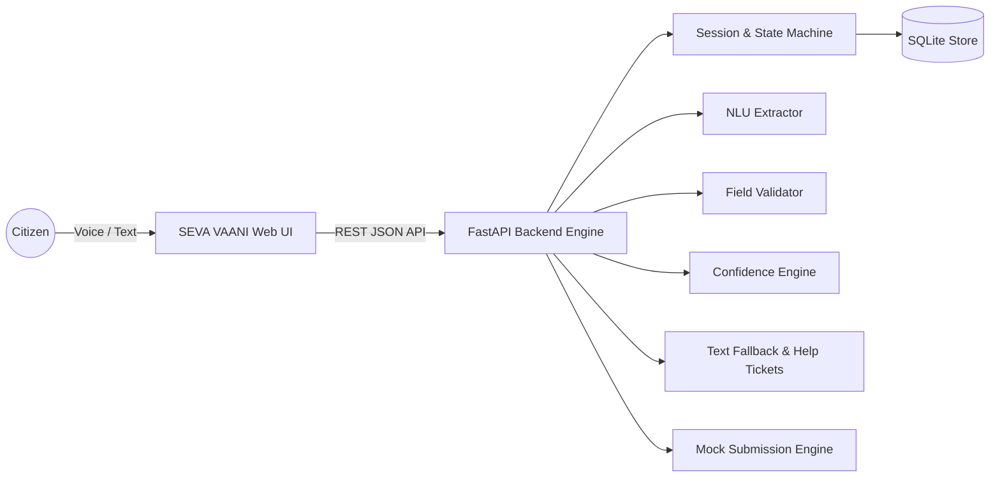

# SEVA VAANI (सेवा वाणी)

> **Multilingual Voice-Based Assistance for Completing Digital Public Services**  
> *Hackathon MVP — Hindi + Marathi — State Scholarship Application*  
> Complies strictly with **SV-PRD-001 v1.0**

---

## 🎯 Product Promise & Principle
> *"Speak naturally. Verify clearly. Complete the service."*  
> **Core Principle: WHEN UNCERTAIN, DO NOT GUESS.**

SEVA VAANI converts digital public service forms into guided, one-question-at-a-time voice conversations in **Hindi** and **Marathi**. It guarantees:
1. **Zero Unconfirmed Commits**: Every critical field requires explicit confirmation before saving.
2. **Deterministic State Machine**: LLMs/NLUs are constrained to extraction/interpretation, never workflow decisions.
3. **Multi-Tier Degradation**: Low confidence triggers clear retries; repeated failures activate typing text fallback; persistent blockers create a human assistance ticket (`TKT-XXXXXX`).
4. **Offline & Low-Bandwidth Resilience**: Session state is persisted after every turn in SQLite; network hiccups never erase progress.

---

## 🏛️ System Architecture



---

## 🚀 Quick Start Guide

### 1. Prerequisites
- Python 3.9+ installed
- Modern browser (Chrome / Edge / Safari / Firefox)

### 2. Setup Backend & Start Application
```bash
# 1. Activate the provided virtual environment
source backend/venv/bin/activate

# 2. Start the FastAPI Unified Server
uvicorn app.main:app --app-dir backend --host 127.0.0.1 --port 8000 --reload
```

Open your browser at:  
👉 **http://127.0.0.1:8000**

---

## 🧪 Running Mandatory Test Cases (TC01 – TC15)

Run the full pytest suite for all 15 PRD mandatory test cases:
```bash
./backend/venv/bin/pytest backend/tests/test_mandatory_cases.py -v
```

All 15 test cases are verified:
- `TC01`: Hindi name extraction + confirmation gate
- `TC02`: Marathi name extraction + confirmation gate
- `TC03`: User says No $\rightarrow$ Candidate discarded
- `TC04`: 9-digit phone $\rightarrow$ Rejected
- `TC05`: 10-digit phone $\rightarrow$ Accepted after confirmation
- `TC06`: Natural-language income normalization ($180,000)
- `TC07`: Unclear speech $\rightarrow$ Polite retry prompt
- `TC08`: Repeated failure ($2\times$) $\rightarrow$ Text fallback offered
- `TC09`: Human help $\rightarrow$ Ticket generated (`TKT-XXXXXX`)
- `TC10`: Language switch (Hindi $\leftrightarrow$ Marathi) without data loss
- `TC11`: Final review showing all 10 verified fields
- `TC12`: Submission without consent $\rightarrow$ Blocked
- `TC13`: Submission with consent $\rightarrow$ Application ID generated
- `TC14`: Network timeout $\rightarrow$ Session state preserved
- `TC15`: Invalid category $\rightarrow$ Re-prompt with allowed values

---

## 📊 Live Judge / Evaluation Mode

In the web interface:
1. Click **"📊 Judge Mode"** in the top navigation bar.
2. View real-time aggregated metrics directly from `/api/metrics`:
   - Controlled field extraction accuracy
   - Unconfirmed critical values submitted (**0**)
   - Task completion rate
   - Median turn latency
3. Toggle the **Low-Bandwidth / 2G-3G Simulator** to test network latency recovery.
4. Click **"Run All 15 Test Cases"** to run the live test suite in the browser.

---

## 🎤 90-Second Demo Script (PRD Section 33)

1. Open http://127.0.0.1:8000
2. Click **"हिन्दी"** $\rightarrow$ Click **"आवेदन शुरू करें"**.
3. Speak or click the quick demo chip: *"मेरा नाम रमेश कुमार है"*.
4. System states: *"मैंने समझा कि आपका नाम Ramesh Kumar है। क्या यह सही है?"*
5. Click or speak **"हाँ, सही है"** $\rightarrow$ Field committed, next question asked.
6. Switch to **"मराठी"** using the top language switcher $\rightarrow$ Notice confirmed fields are preserved!
7. Speak or click *"अस्पष्ट ध्वनि [unclear]"* $\rightarrow$ System requests clear retry.
8. Click *"987654321"* $\rightarrow$ System highlights that phone numbers must be 10 digits.
9. Finish the fields $\rightarrow$ View the full **Review Summary**.
10. Check the explicit consent checkbox $\rightarrow$ Click **"अंतिम आवेदन जमा करें"**.
11. Observe receipt with unique Application ID: `SV-SCH-2026-XXXX`.
