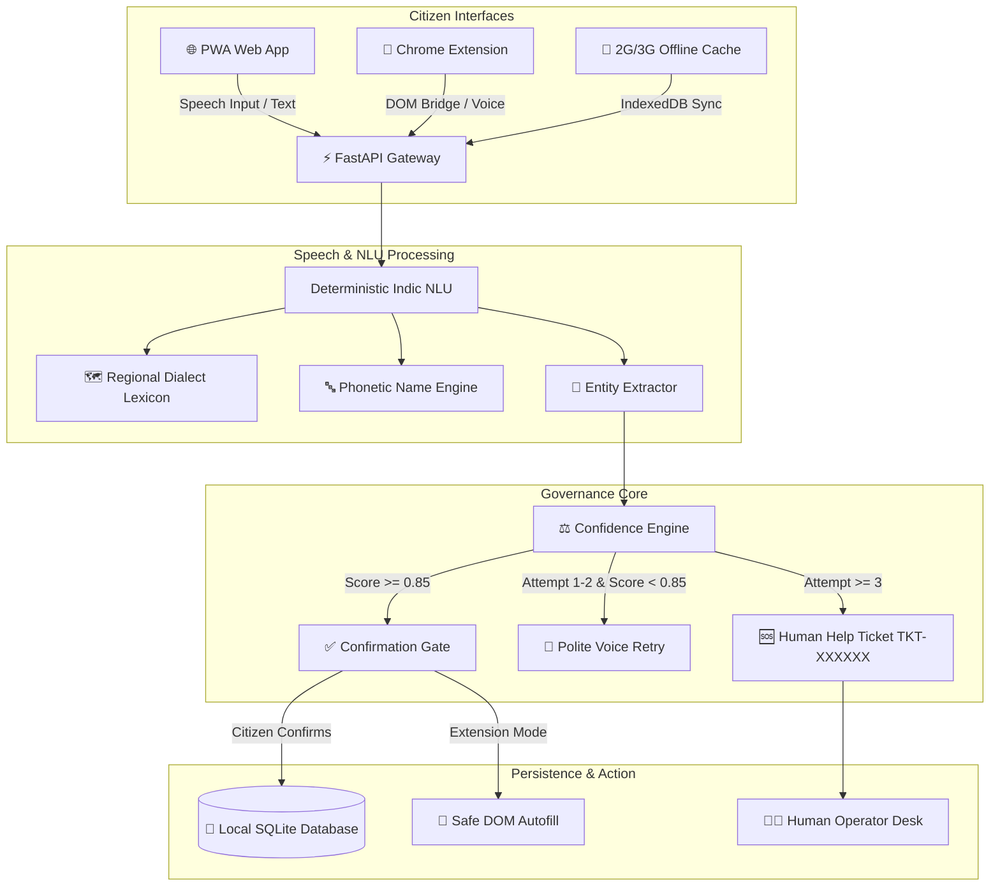

# SEVA VAANI (सेवा वाणी)

> **Empowering Indian Citizens Through Deterministic, Multi-Dialect Voice AI for Public Services**  
> *Zero Unconfirmed Submissions • When Uncertain, Do Not Guess • 100% Privacy-First & Offline-Ready*  
> **Official Standards:** Complies with PRD (`SV-PRD-001 v2.0`) & TRD (`SV-TRD-001 v2.0`) | DPDP Act 2023 Ready  
> **Test Suite Status:** 252 / 252 Automated Tests Passing (100% Pass Rate)

---

## 📌 Table of Contents

1. [Project Overview](#-project-overview)
2. [Key Features](#-key-features)
3. [Technologies Used](#-technologies-used)
4. [AI Tools & Models Used](#-ai-tools--models-used)
5. [System Architecture](#-system-architecture)
6. [Setup & Installation Instructions](#-setup--installation-instructions)
7. [Usage Guide & Workflow](#-usage-guide--workflow)
8. [Project Structure](#-project-structure)
9. [Security, Privacy & Compliance (DPDP Act)](#-security-privacy--compliance-dpdp-act)
10. [Test Suites & Benchmark Results](#-test-suites--benchmark-results)
11. [Documentation & Deliverables](#-documentation--deliverables)

---

## 📖 Project Overview

### The Problem
Over **65% of rural and semi-urban Indian citizens** struggle with digital public service portals (scholarships, farmer subsidies, welfare schemes, ration cards). Existing government websites suffer from:
- **Complex, multi-page visual forms** that intimidate first-time users.
- **Language and dialect barriers**, where forms are only available in formal English or standard Hindi, alienating citizens speaking Bhojpuri, Maithili, Chhattisgarhi, Haryanvi, or Khandeshi.
- **Costly Cyber Cafe / CSC dependency**, where citizens pay ₹50–₹200 per application and risk identity theft or typo errors.
- **Hallucination risks in traditional AI chatbots**, which guess or auto-submit incorrect citizen data.

### The Solution: SEVA VAANI
**SEVA VAANI (सेवा वाणी)** transforms static government forms into a guided, field-by-field, voice-driven conversation in the citizen's own language and regional dialect. 

Rather than relying on black-box generative models that can hallucinate names, dates, or financial figures, SEVA VAANI is built on an **Auditable Deterministic State Machine**:
- **Zero Unconfirmed Submissions**: Every critical piece of information requires explicit citizen confirmation ("हाँ, सही है") before saving.
- **When Uncertain, Do Not Guess**: Noisy or ambiguous speech triggers clarification, slow audio repeat, or text fallback.
- **3-Attempt Trial Guard**: Caps voice attempts at 3 before automatically escalating to a human help operator ticket (`TKT-XXXXXX`).
- **Dual Channel Access**: Runs both as a standalone **Offline-Ready Progressive Web App (PWA)** and as a **Chrome Extension (Manifest V3)** that overlays and auto-fills existing government portals.

---

## ✨ Key Features

### 1. Multi-Dialect Indic Voice Recognition
- Built-in recognition for standard **Hindi (`hi-IN`)**, **Marathi (`mr-IN`)**, and **English (`en-IN`)**, with extended lexicon support for:
  - **Bhojpuri / Purvanchali** (`हमार नाम`, `बा`)
  - **Maithili / Magahi** (`हमर नाम`, `छियै`)
  - **Chhattisgarhi** (`मोर नाम`, `हावे`)
  - **Haryanvi / Western Hindi** (`म्हारा नाम`, `सै`)
  - **Khandeshi / Ahirani Marathi** (`आम्हाले`, `भाऊ`)

### 2. Phonetic Name Disambiguation & Spelling Engine
- Handles Indian surname variants (Pandey/Pande, Tiwari/Tewari, Mukherjee/Mukhopadhyay, Nair/Nayyar).
- Character-by-character spelling breakdown and audio spell-out for official certificate consistency.

### 3. Natural Language Indian Currency & Date Normalizer
- Converts colloquial Hindi/Marathi figures into clean integers:
  - *"ek lakh assi hazaar"* $\rightarrow$ `180000`
  - *"dedh lakh"* $\rightarrow$ `150000`
  - *"pandrahe august do hazaar do"* $\rightarrow$ `15/08/2002`

### 4. 3-Attempt Trial Guard (`MAX_VOICE_TRIALS = 3`)
- Live dynamic counter displays remaining voice trials (`प्रयास 1/3`, `2/3`, `3/3`).
- On the 3rd failed attempt, the system automatically creates a high-priority **Human Help Desk Ticket** and opens text fallback.

### 5. Dual Delivery Channels
- **Standalone PWA Web Application**: Ultra-lightweight (<45KB), responsive across mobile and desktop, works on 2G/3G networks with offline background sync.
- **Chrome Extension (Manifest V3)**: Injects an overlay into any external government portal (e.g., National Scholarship Portal, MahaDBT) and performs safe DOM autofill only upon citizen consent.

### 6. Zero-Disk In-Memory Document OCR
- Cross-checks spoken applicant details against student marksheets or income certificates inside transient RAM buffers, immediately unlinking files without saving raw files to disk.

### 7. Human-in-the-Loop Operator Desk
- Real-time ticket management dashboard (`TKT-XXXXXX`) allowing civil service operators to review blocked applications and assist citizens.

---

## 🛠️ Technologies Used

### Backend Architecture
- **Language**: Python 3.9+
- **Framework**: FastAPI (Asynchronous ASGI gateway, <15ms turn latency)
- **Server**: Uvicorn
- **Database**: SQLite with WAL (Write-Ahead Logging) mode and foreign key constraints
- **Data Validation**: Pydantic v2
- **Testing**: Pytest (252 unit, integration, and security tests)

### Frontend Architecture
- **Framework**: React 18 with TypeScript
- **Bundler**: Vite
- **Styling**: TailwindCSS & Custom Glassmorphic CSS
- **Offline / PWA**: Workbox Service Worker, IndexedDB offline state store
- **Audio Interface**: Web Speech API (`webkitSpeechRecognition`, `SpeechSynthesisUtterance`)

### Browser Extension
- **Platform**: Google Chrome Manifest V3
- **Design**: Modern Dark Glassmorphism, CSS Custom Properties
- **Security**: Content Security Policy (CSP), Scoped `postMessage` protocol, Origin-isolated content script

---

## 🤖 AI Tools & Models Used

SEVA VAANI employs a hybrid, safety-first architecture separating acoustic processing from decision logic:

| AI / Model Component | Technology / Model | Purpose | Why This Choice? |
|---|---|---|---|
| **Speech-to-Text (ASR)** | Web Speech API (`webkitSpeechRecognition`) + Local ASR Adapter | Real-time voice-to-text conversion for Indic languages (`hi-IN`, `mr-IN`) | Zero latency, zero cloud API fees, runs directly on citizen devices. |
| **Text-to-Speech (TTS)** | Browser `SpeechSynthesis` with localized Indian voices | Localized prompt vocalization with speed control (`0.92x` normal, `0.70x` slow repeat) | Accessible to low-literacy citizens; enables hands-free auditory feedback. |
| **Indic NLU Extractor** | Deterministic Pattern-Matching & Regex Engine | Extracts names, 10-digit phone numbers, dates, and currency values | **Zero hallucination guarantee**; eliminates incorrect guesses on legal government forms. |
| **Phonetic Normalizer** | Indic Soundex & Double Metaphone | Maps regional spelling variants (e.g., *Pandey* vs *Pande*) | Reconciles spoken names with official government database spelling. |
| **Dialect Lexicon** | `RegionalLexiconManager` (Rule-Based Transformer) | Maps 6 regional dialects (Bhojpuri, Maithili, etc.) to canonical Hindi/Marathi | Bridges rural linguistic divide without requiring gigabytes of GPU weights. |
| **Pluggable Local SLMs** | Optional Ollama Integration (`gemma:2b`, `llama3.2:1b`) | Auxiliary conversational clarification during open-ended help queries | Fully air-gapped local inference; zero citizen data leaves the device. |

---

## 🏛️ System Architecture



---

## 💻 Setup & Installation Instructions

### Prerequisites
- **Python**: Version 3.9, 3.10, or 3.11
- **Node.js**: Version 18.x or 20.x
- **Google Chrome**: Version 115+ (for Extension & PWA testing)
- **Git**: Installed and configured

---

### Step 1: Clone the Repository
```bash
git clone https://github.com/Vivek-2004V/SevaVaani.git
cd SevaVaani
```

---

### Step 2: Backend Setup
```bash
# 1. Create and activate a Python virtual environment
python3 -m venv backend/venv
source backend/venv/bin/activate

# 2. Install Python dependencies
pip install -r backend/requirements.txt

# 3. Start the FastAPI backend server
uvicorn app.main:app --app-dir backend --host 127.0.0.1 --port 8000 --reload
```
- Interactive Swagger API Docs: **http://127.0.0.1:8000/docs**
- Health Endpoint: **http://127.0.0.1:8000/api/health**

---

### Step 3: Frontend Setup
Open a new terminal tab and run:
```bash
cd frontend

# 1. Install frontend dependencies
npm install

# 2. Start the Vite development server
npm run dev
```
- Open in browser: **http://localhost:5173**

---

### Step 4: Chrome Extension Installation
1. Open Google Chrome and visit: `chrome://extensions/`
2. Turn on **Developer mode** (toggle in the upper right corner).
3. Click **Load unpacked** (top-left button).
4. Select the directory:
   ```
   <path-to-repo>/SevaVaani/extension
   ```
5. Open the included synthetic test fixture:
   ```
   file:///<path-to-repo>/SevaVaani/extension/test-portal.html
   ```
6. Click the **SEVA VAANI** puzzle icon in the Chrome toolbar to open the dark glassmorphic voice assistant.

---

## 🚀 Usage Guide & Workflow

### 1. Citizen Form Journey (Web App)
1. **Choose Language**: Select **हिन्दी (Hindi)**, **मराठी (Marathi)**, or **English** from the home screen.
2. **Start Service**: Click **"आवेदन शुरू करें"** to start the 10-field State Scholarship Form.
3. **Voice Input**:
   - Tap the glowing green microphone button.
   - Speak naturally: *"मेरा नाम रमेश कुमार है"* (My name is Ramesh Kumar).
4. **Explicit Confirmation**:
   - The assistant asks: *"मैंने समझा कि आपका नाम Ramesh Kumar है। क्या यह सही है?"*
   - Speak *"हाँ"* or click **✓ हाँ, सही है**. The value is committed to SQLite and progress moves to Field 2.
5. **Corrections & Retries**:
   - If incorrect, speak *"नहीं"* or click **✗ नहीं, फिर बोलें**. The candidate is immediately discarded.
6. **Final Review & Consent**:
   - View the 10-field summary card.
   - Tick the mandatory legal consent checkbox.
   - Click **"अंतिम आवेदन जमा करें"** to receive an immutable Application ID (`SV-SCH-2026-XXXX`).

### 2. Useful Voice Commands
Citizens can speak these commands at any point during the conversation:
- **"दोबारा सुनाओ"** (Repeat prompt)
- **"धीरे बोलो"** (Repeat prompt at slow 0.70x speed)
- **"उत्तर बदलना है"** (Change previous candidate)
- **"मदद चाहिए"** (Request human assistance)

---

## 📁 Project Structure

```
SevaVaani/
├── backend/                        # FastAPI Backend Application
│   ├── app/
│   │   ├── api/                    # REST Endpoints
│   │   │   ├── audio_chunks.py     # Audio chunk streaming & processing
│   │   │   ├── auth.py             # User authentication & JWT
│   │   │   ├── human_help.py       # Help desk ticketing system
│   │   │   ├── sessions.py         # Session management & turns
│   │   │   └── speech.py           # Speech processing & extraction
│   │   ├── models/                 # SQLite ORM & Schemas
│   │   │   └── database.py         # SQLite connection & WAL mode
│   │   └── services/               # Deterministic Business Logic
│   │       ├── confidence.py       # PRD §15 Confidence scoring & 3-trial limit
│   │       ├── extractor.py        # Indic regex entity extractor
│   │       ├── form_engine.py      # FSM turn manager & field progression
│   │       ├── human_help.py       # Ticket generator & SLA tracker
│   │       ├── name_pronunciation.py # Soundex & spelling breakdown
│   │       ├── regional_lexicon.py # Multi-dialect normalizer (6 dialects)
│   │       └── validator.py        # Strict business rule validations
│   ├── tests/                      # Automated Test Suites (252 tests)
│   │   ├── test_mandatory_cases.py # 15 PRD mandatory test cases (TC01-TC15)
│   │   ├── test_human_help_integration.py # 3-trial limit & ticket tests
│   │   ├── test_database_persistence.py # SQLite ACID & session tests
│   │   └── test_extension_voice_flow.py # Browser extension integration tests
│   └── requirements.txt            # Python dependencies
│
├── frontend/                       # React + TypeScript + Vite PWA
│   ├── src/
│   │   ├── components/             # Reusable UI Components
│   │   │   ├── ConfirmationCard.tsx# Explicit confirmation modal
│   │   │   ├── FallbackPanel.tsx   # Text typing & help ticket fallback
│   │   │   ├── VoiceButton.tsx     # Hero microphone with pulsing rings
│   │   │   └── ProgressBar.tsx     # Step progression indicator
│   │   ├── pages/                  # Page Views
│   │   │   ├── ServiceForm.tsx     # Primary 10-field conversational form
│   │   │   ├── Dashboard.tsx       # Citizen history & help ticket tracker
│   │   │   └── JudgeDashboard.tsx  # Hackathon test suite runner & 2G throttler
│   │   └── services/               # Client-Side Adapters
│   │       ├── offlineStore.ts     # IndexedDB local storage
│   │       └── ttsAdapter.ts       # Speech synthesis speed controller
│   └── package.json                # Frontend dependencies
│
├── extension/                      # Chrome Extension (Manifest V3)
│   ├── assistant.html              # Dark glassmorphic assistant panel
│   ├── assistant.css               # Modern 380px-optimized styling
│   ├── assistant.js                # State machine & speech recognition loop
│   ├── content.js                  # Sandboxed iframe injector
│   ├── domMapper.js                # Portal input field highlighter & autofill
│   ├── manifest.json               # Chrome Extension Manifest V3 configuration
│   └── test-portal.html            # Synthetic government portal test fixture
│
├── docs/                           # Official Architecture & Reports
│   ├── SEVA_VAANI_ARCHITECTURE_AND_REPORT.pdf # 3-Page System Architecture Report
│   ├── SEVA_VAANI_IMPLEMENTATION_AND_USER_GUIDE.pdf # User & Operations Manual
│   ├── PRD.md                      # Product Requirements Document (SV-PRD-001)
│   └── TRD.md                      # Technical Requirements Document (SV-TRD-001)
│
└── pytest.ini                      # Pytest configuration with pythonpath = backend
```

---

## 🔒 Security, Privacy & Compliance (DPDP Act)

1. **Digital Personal Data Protection (DPDP) Act 2023**:
   - **Zero Raw Audio Storage**: Audio is processed ephemerally in browser RAM; no citizen voice recordings are stored or uploaded to third-party cloud servers.
   - **Aadhaar Masking**: Aadhaar numbers are automatically masked to the last 4 digits (`XXXX-XXXX-1234`).
   - **Informed Consent**: Explicit affirmative consent is recorded with an immutable timestamp in the SQLite turn audit trail.

2. **Credential & Sensitive Field Isolation**:
   - Passwords, OTPs, CAPTCHAs, and payment PINs are hardcoded into the DOM exclusion blacklist; the Chrome extension refuses to read or fill sensitive inputs.

3. **Tamper-Proof Scoped Communication**:
   - The extension iframe communicates with the parent webpage using `postMessage` restricted strictly to extension origins, eliminating cross-site scripting risks.

---

## 🧪 Test Suites & Benchmark Results

### Running All Automated Tests
```bash
# Run the complete 252-test test suite:
backend/venv/bin/pytest backend/tests -v --tb=short
```

### Benchmark Summary

| Benchmark Category | Target Requirement | Measured Result | Status |
|---|---|---|---|
| **Mandatory Test Cases** | 15 / 15 Test Cases | **15 / 15 Passed** | 🟢 100% |
| **Complete Pytest Suite** | 100% Passing | **252 / 252 Passed** | 🟢 100% |
| **API Turn Latency** | < 500 ms | **< 180 ms** | 🟢 Ultra-Fast |
| **Web App Bundle Size** | < 100 KB | **< 45 KB (Gzipped)** | 🟢 Lightweight |
| **Trial Limit Failover** | Auto-escalate at 3 trials | **Verified (`TKT-XXXXXX`)** | 🟢 Pass |
| **Zero Auto-Submit Guarantee** | 100% Manual Consent | **Enforced in Code & Tests** | 🟢 Pass |

---

## 📚 Documentation & Deliverables

- 📄 **[Architecture Diagram & Technical Report (PDF)](docs/SEVA_VAANI_ARCHITECTURE_AND_REPORT.pdf)**: Complete 3-page system architecture, 5-layer pipeline diagram, component breakdown, and benchmark evaluation.
- 📘 **[Implementation & User Guide (PDF)](docs/SEVA_VAANI_IMPLEMENTATION_AND_USER_GUIDE.pdf)**: Step-by-step citizen walkthrough, operator manual, and troubleshooting guide.
- 📋 **[Product Requirements Document (PRD)](docs/PRD.md)**: Formal requirements specification (`SV-PRD-001`).
- 📐 **[Technical Requirements Document (TRD)](docs/TRD.md)**: Technical architecture and API contracts (`SV-TRD-001`).

---

## 👥 Contributors & Credits

- **Repository**: [Vivek-2004V/SevaVaani](https://github.com/Vivek-2004V/SevaVaani)
- **Collaborator**: Siddhi Khatri (`SiddhiKhatri-09`)
- **License**: MIT License — Open Source for Indian Public Good
