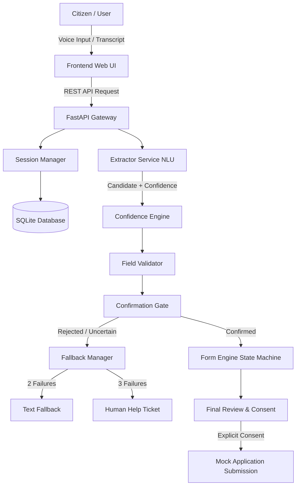

# SEVA VAANI — System Architecture Document

**Document ID**: SV-ARCH-001  
**Version**: 1.0  
**Status**: Implemented & Verified  

---

## 1. High-Level Architecture Overview

SEVA VAANI replaces complex visual forms with an auditable, deterministic, field-by-field voice conversation while guaranteeing:
- **Zero Unconfirmed Commits**: Critical values must pass an explicit confirmation gate before state transition.
- **When Uncertain, Do Not Guess**: Ambiguous or noisy utterances trigger polite clarification or retries, not hallucinated values.
- **Fail-Safe Fallbacks**: Multi-tier degradation to text fallback and human help ticket creation.

---

## 2. Component Specifications

### 2.1 Frontend Web UI (`frontend/`)
- Pure Vanilla CSS + JS: Ultra-lightweight payload (< 45KB), responsive across mobile and desktop.
- Web Speech API integration: Browser-native ASR (`webkitSpeechRecognition`) and TTS (`SpeechSynthesis`) with `hi-IN` and `mr-IN` support.
- Judge & Evaluation Dashboard: In-app real-time metrics, low-bandwidth 2G/3G throttler, and automated 15-test-case runner.

### 2.2 FastAPI Backend (`backend/app/`)
- **`services/form_engine.py`**: State machine controlling field progression, session persistence, turn tracking, and submission.
- **`services/extractor.py`**: Regex and pattern-based NLU extracting Indian names, dates, phone numbers, and normalizing natural language Hindi/Marathi denominations (e.g., *"ek lakh assi hazaar"* $\rightarrow$ `180000`).
- **`services/confidence.py`**: Enforces PRD Section 15 confidence thresholds:
  - $\ge 0.85$: High confidence confirmation gate
  - $0.60 - 0.84$: Clarification prompt
  - $< 0.60$: Retry request
  - 2 consecutive failures: Prominent text fallback
  - 3 failures: Automated human help ticket creation (`TKT-XXXXXX`)
- **`services/validator.py`**: Enforces strict business rules (10-digit phone, valid calendar dates, allowed enums).

### 2.3 Data Storage (`backend/app/models/database.py`)
- SQLite storage with zero operational overhead, storing `sessions`, `field_values`, `turns`, `help_tickets`, and `applications`.
